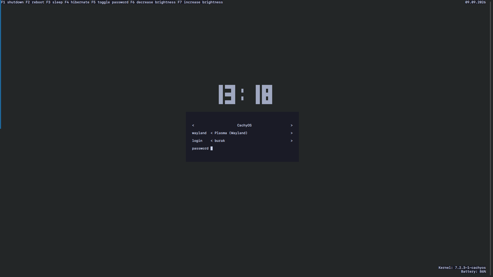

# CachyOS / Arch Linux Dotfiles and Scripts

This repository contains personal desktop configuration files and small helper
scripts for KDE Plasma 6 on a Wayland session. It is an opinionated starting
point, not a universal installation profile: several entries depend on
optional applications, NVIDIA graphics, or local hardware.

This is an independent, unofficial project and is not affiliated with,
endorsed by, or sponsored by the respective trademark owners.

## 🖼️ Preview

<p align="center">
  
  <br>
  <em>Ly TUI Display Manager — Custom Tokyo Night & Nord Setup</em>
</p>

## Scope

Included configuration covers Zsh, KDE Plasma shortcuts and window rules,
Konsole profiles and colors, Ly, and optional desktop autostart entries.
This repository does not install packages, manage system updates, provision
hardware, or include the applications referenced by optional autostart files.

## Requirements

The complete configuration targets:

- Arch Linux or a compatible distribution with `pacman`
- KDE Plasma 6, preferably on Wayland
- Zsh and Powerlevel10k
- Ly, if the display-manager configuration is installed

Optional features require `brightnessctl`, `systemctl`, Cloudflare WARP,
Docker, Free Download Manager, Easy Effects, Dikte, Meme Picker, or the
NVIDIA `prime-run` wrapper. `prime-java.sh` requires Java and `prime-run`.
Review each optional file before enabling it on another machine.

## Included scripts

### 1. `audit-system.sh`
A system-auditing tool for Arch-based distributions. It scans and reports:
- Modified official package configurations (`pacman -Qii`).
- Unowned/custom system files in `/etc` and `/usr/local`.
- Overridden `systemd` services and masked units.
- Custom kernel module settings, sysctl, and udev rules.

### 2. `prime-java.sh`
A wrapper that runs Java applications through `prime-run` on systems with
NVIDIA PRIME support. Set `JAVA_HOME` when a specific Java installation is
required.

## ⚙️ Core Configurations
- **Zsh:** `.zshrc` with optional Powerlevel10k, Cloudflare WARP aliases, and a Docker WinBoat helper.
- **KDE Plasma 6:** Global shortcuts (`kglobalshortcutsrc`), KWin window rules (`kwinrulesrc`), and custom autostart desktop entries.
- **Konsole:** Main configuration (`konsolerc`), custom profiles, and `MaterialYou` color schemes.
- **Ly TUI Display Manager:** Custom login screen configuration (`/etc/ly/config.ini`) featuring Nord/Tokyo Night aesthetics and sequential function keybinds.

## Installation

Set the repository location once, then create only the links you need. The
following helper backs up an existing non-symlink file before replacing it and
does nothing when the desired symlink already points at this repository:

```bash
PROJECT_DIR="${PROJECT_DIR:-$HOME/dotfiles}"
git clone https://github.com/buraakkcayir/dotfiles.git "$PROJECT_DIR"

backup_and_link() {
    source=$1
    target=$2
    if [ -L "$target" ] && [ "$(readlink -f "$target")" = "$(readlink -f "$source")" ]; then
        return
    fi
    if [ -e "$target" ] || [ -L "$target" ]; then
        backup="${target}.backup.$(date +%Y%m%d%H%M%S)"
        mv "$target" "$backup"
        printf 'Backed up %s to %s\n' "$target" "$backup"
    fi
    ln -s "$source" "$target"
}

mkdir -p "$HOME/.config" "$HOME/.local/share/konsole" "$HOME/.config/autostart"
backup_and_link "$PROJECT_DIR/.zshrc" "$HOME/.zshrc"
backup_and_link "$PROJECT_DIR/kwinrulesrc" "$HOME/.config/kwinrulesrc"
backup_and_link "$PROJECT_DIR/kglobalshortcutsrc" "$HOME/.config/kglobalshortcutsrc"
backup_and_link "$PROJECT_DIR/konsolerc" "$HOME/.config/konsolerc"

for file in "$PROJECT_DIR"/konsole/*; do
    backup_and_link "$file" "$HOME/.local/share/konsole/$(basename "$file")"
done

for file in "$PROJECT_DIR"/autostart/*; do
    backup_and_link "$file" "$HOME/.config/autostart/$(basename "$file")"
done
```

The Ly configuration is optional and replaces a system file. Back it up before
installing it, and keep the printed backup path for uninstall:

```bash
LY_BACKUP="/etc/ly/config.ini.backup.$(date +%Y%m%d%H%M%S)"
sudo install -Dm644 /etc/ly/config.ini "$LY_BACKUP"
sudo ln -sfn "$PROJECT_DIR/etc/ly/config.ini" /etc/ly/config.ini
printf 'Ly backup: %s\n' "$LY_BACKUP"
```

Autostart entries for Dikte, Meme Picker, and the Razer helper use commands
that must be available in `PATH`. Install or adapt those applications before
enabling the corresponding entries. The FDM entry assumes the `fdm` command
is available in `/opt/freedownloadmanager`.

## Configuration

| File | Purpose | Main dependency |
| --- | --- | --- |
| `.zshrc` | Shell startup and optional aliases | Zsh |
| `scripts/audit-system.sh` | Arch/systemd audit report | `pacman`, `systemd` |
| `scripts/prime-java.sh` | Java through NVIDIA PRIME | Java, `prime-run` |
| `etc/ly/config.ini` | Ly login screen | Ly, `systemctl`, `brightnessctl` |
| `autostart/*.desktop` | Optional desktop startup entries | Application-specific |

The KDE and Konsole files are exports from one Plasma installation. Review
shortcut and window-rule entries before applying them to a different desktop.

## Troubleshooting

- If Zsh reports a missing CachyOS configuration, install the distribution
  package or remove that optional integration.
- If `prime-java.sh` cannot find Java, install a JRE/JDK or set `JAVA_HOME`.
- If the Ly battery label is unavailable, the machine has no readable battery
  device; the rest of the login configuration remains usable.
- If an autostart entry fails, run its `Exec` command manually and verify that
  the executable is in `PATH`.

## Uninstall

Remove only symlinks that still point to this repository. Do not remove a
regular file at one of these paths. Restore the Ly backup before removing its
symlink. Set `LY_BACKUP` to the path printed during installation:

```bash
PROJECT_DIR="${PROJECT_DIR:-$HOME/dotfiles}"
remove_repo_link() {
    source=$1
    target=$2
    if [ -L "$target" ] && [ "$(readlink -f "$target")" = "$(readlink -f "$source")" ]; then
        rm "$target"
    fi
}

remove_repo_link "$PROJECT_DIR/.zshrc" "$HOME/.zshrc"
remove_repo_link "$PROJECT_DIR/kwinrulesrc" "$HOME/.config/kwinrulesrc"
remove_repo_link "$PROJECT_DIR/kglobalshortcutsrc" "$HOME/.config/kglobalshortcutsrc"
remove_repo_link "$PROJECT_DIR/konsolerc" "$HOME/.config/konsolerc"

for file in "$PROJECT_DIR"/konsole/* "$PROJECT_DIR"/autostart/*; do
    [ -e "$file" ] || continue
    case "$file" in
        "$PROJECT_DIR"/konsole/*) target="$HOME/.local/share/konsole/$(basename "$file")" ;;
        *) target="$HOME/.config/autostart/$(basename "$file")" ;;
    esac
    remove_repo_link "$file" "$target"
done

LY_BACKUP="${LY_BACKUP:?Set LY_BACKUP to the backup path printed during installation}"
if [ -L /etc/ly/config.ini ] && [ "$(readlink -f /etc/ly/config.ini)" = "$(readlink -f "$PROJECT_DIR/etc/ly/config.ini")" ]; then
    sudo test -f "$LY_BACKUP" || {
        printf 'Ly backup does not exist: %s\n' "$LY_BACKUP" >&2
        exit 1
    }
    sudo rm /etc/ly/config.ini
    sudo install -Dm644 "$LY_BACKUP" /etc/ly/config.ini
fi
```

## Security notes

Do not commit credentials, exported environment files, private keys, or
machine-specific logs. `audit-system.sh` writes a local report containing
system information; review and redact it before sharing.

## License

MIT License. See [LICENSE](LICENSE).

Third-party applications, names, and logos referenced by configuration files
remain subject to their respective licenses and trademarks.
